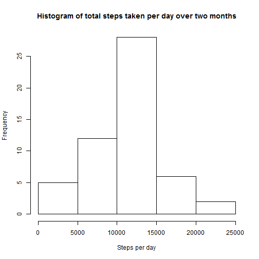
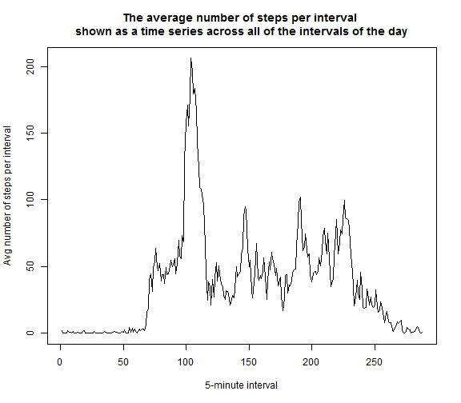
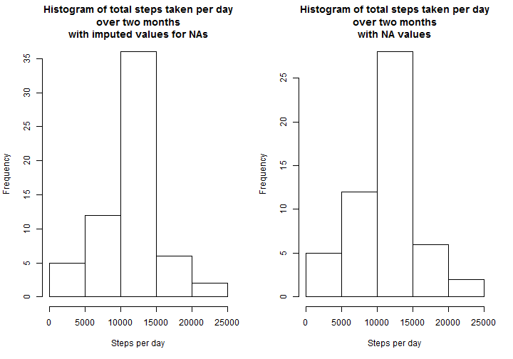
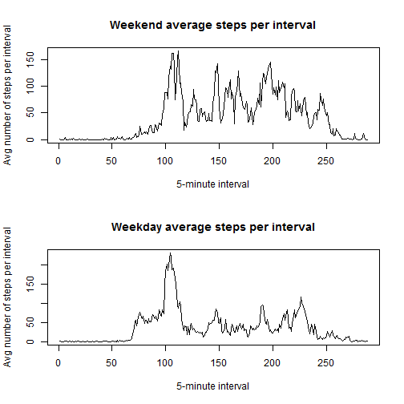

# Reproducible Research: Peer Assessment 1

This document will show all of the steps taken to recreate the
required charts and do the required analysis of the data.

## Loading and preprocessing the data

The first step is to pull in the data. The data comes from a zipped 
file and we will unzip it. The following code
loads the data and creates a histogram of the steps taken each day:


```r
unzip("./activity.zip")
thedata <- read.csv("./activity.csv")
# Split the data by date
spldata <- (split(thedata, thedata$date))
stepsum <- lapply(spldata, function(x) sum(x$steps))
# apply the sum function to each 'date' and then show the histogram
hist(sapply(stepsum, sum), main = "Histogram of total steps taken per day over two months", 
    xlab = "Steps per day")
```

 


## What is mean total number of steps taken per day?

Next we need to find the **mean** and **median** for the number of steps per day. The mean was pretty easy:


```r
rowMeans(data.frame(stepsum), na.rm = TRUE)
```

```
## [1] 10766
```


Now the median - this one was a real pain in the ass!!


```r
median(as.vector(stepsum, mode = "numeric"), na.rm = TRUE)
```

```
## [1] 10765
```


## What is the average daily activity pattern?

Next up is the Average Daily Activity Pattern. Here are the instructions:  


    Make a time series plot (i.e. type = "l") of the 5-minute interval (x-axis) and the average number of steps taken, averaged across all days (y-axis)

    Which 5-minute interval, on average across all the days in the dataset, contains the maximum number of steps?


Now, this was not clear to me on first review, so I consulted the discussion boards. Apparently the assignment is to find the mean for all of the 5 minute intervals of the day. Again, I will use one of the "apply" funcitons to do this.


```r
byint <- split(thedata, thedata$interval)
intmeans <- lapply(byint, function(x) mean(x$steps, na.rm = TRUE))
plot(ts(intmeans), ylab = "Avg number of steps per interval", xlab = "5-minute interval", 
    main = "The average number of steps per interval \nshown as a time series across all of the intervals of the day")
```

 

```r
# axis(1, names(intmeans)) names(intmeans)
```


The interval which has the highest average number of steps along with that average is found as follows:

```r
intmeans[which.max(intmeans)]
```

```
## $`835`
## [1] 206.2
```


## Imputing missing values


Next we need to figure out what to do with NA values for steps for an interval. My strategy is to simply replace the NA with the average for that interval. First, here are the number of NAs:

```r
sum(is.na(thedata[, 1]))
```

```
## [1] 2304
```


Now do the imputed values for the NA steps


```r
filledData <- thedata
for (r in 1:nrow(filledData)) {
    if (is.na(filledData[r, 1])) 
        filledData[r, 1] <- intmeans[[as.character(filledData[r, 3])]]
}
sum(is.na(filledData[, ]))
```

```
## [1] 0
```


Histogram the new data:

```r

# Split the data by date
spldata2 <- (split(filledData, filledData$date))
stepsum2 <- lapply(spldata2, function(x) sum(x$steps))
# set up the display
par(mfrow = c(1, 2))
# apply the sum function to each 'date' and then show the histogram
hist(sapply(stepsum2, sum), main = "Histogram of total steps taken per day\nover two months\nwith imputed values for NAs", 
    xlab = "Steps per day")
# show the original plot
hist(sapply(stepsum, sum), main = "Histogram of total steps taken per day\nover two months\nwith NA values", 
    xlab = "Steps per day")
```

 


And the **mean** and **median**

```r
rowMeans(data.frame(stepsum2), na.rm = TRUE)
```

```
## [1] 10766
```

```r

median(as.vector(stepsum2, mode = "numeric"), na.rm = TRUE)
```

```
## [1] 10766
```


So, with imputing the average for any NAs, the mean will obviously be the same and the median gets closer to the mean.
The histogram simply has a higher frequency for the values nearer the mean which, in retrospect, is pretty obvious since we used the mean for any NA values.

## Are there differences in activity patterns between weekdays and weekends?

Now we are going to see if there is a difference between weekdays and weekends. I'm going to set up some R code for this:


```r
daytype <- c("Weekday", "Weekend")
day <- rep(NA, nrow(filledData))
filledData <- cbind(filledData, day)
for (r in 1:nrow(filledData)) {
    dayname <- weekdays(as.Date(filledData[r, ]$date))
    if (dayname == "Saturday" || dayname == "Sunday") 
        filledData[r, ]$day <- "Weekend" else filledData[r, ]$day <- "Weekday"
}
```

Now that the code is working to fill the new column with Weekday or Weekend, and the code is cached, I will continue...

Subset the weekday from the weekend data

```r
monfri <- filledData[filledData$day == "Weekday", ]
satsun <- filledData[filledData$day == "Weekend", ]
```


Process the data to get the averages for the intervals

```r
mfbyint <- split(monfri, monfri$interval)
mfintmeans <- lapply(mfbyint, function(x) mean(x$steps, na.rm = TRUE))
ssbyint <- split(satsun, satsun$interval)
ssintmeans <- lapply(ssbyint, function(x) mean(x$steps, na.rm = TRUE))
par(mfcol = c(2, 1))
plot(ts(ssintmeans), ylab = "Avg number of steps per interval", xlab = "5-minute interval", 
    main = "Weekend average steps per interval")
plot(ts(mfintmeans), ylab = "Avg number of steps per interval", xlab = "5-minute interval", 
    main = "Weekday average steps per interval")
```

 


In conclusion, it is really cool that the data analysis shows that the person in this study was more active throughout the day on weekends than on weekdays. There seems to be a flurry of activity in the AM and in the PM with a lull during the day for weekdays. 
